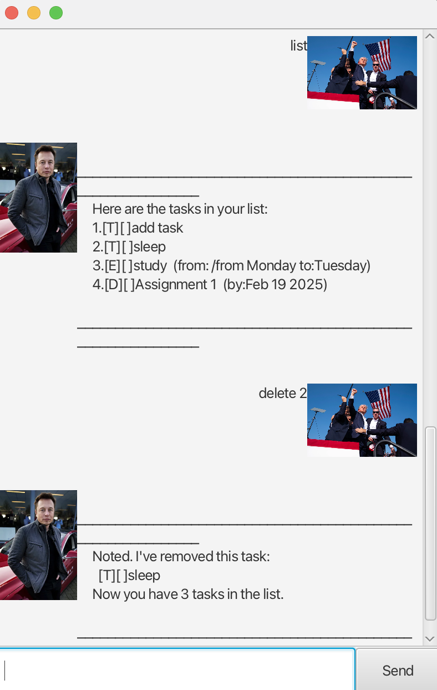

# Nana User Guide



**Welcome to Nana, your personal task management chatbot.**

Nana manages your tasks with priority efficiently by organizing them into three categories: Todos, Deadlines, and Events.


## Adding todos

Add a todo by providing the task description.

Example: `todo sleep`

Expected output:

```
    ____________________________________________________________
     Got it. I've added this task:
       [T][ ]sleep 
     Now you have 1 tasks in the list.
    ____________________________________________________________
```

## Adding deadlines

Add a deadline by providing the task description and the due date.

Example: `deadline Assignment 1 /by 2025-02-19`

Expected output:

```
    ____________________________________________________________
     Got it. I've added this task:
       [D][ ]Assignment 1  (by:Feb 19 2025)
     Now you have 2 tasks in the list.
    ____________________________________________________________
```

## Adding events

Add an event by providing the task description and the beginning time and ending time.

Example: `event final exam /from Monday /to Wendesday`

Expected output:

```
    ____________________________________________________________
     Got it. I've added this task:
       [E][ ]final exam  (from: /from Monday to:Wendesday)
     Now you have 3 tasks in the list.
    ____________________________________________________________
```

## Searching for Tasks

Search for tasks by providing a keyword.

Example: `final exam`

Expected output if task is found:

```
    ____________________________________________________________
     Here are the matching tasks in your list:
     1.[E][ ]study  (from: /from Monday to:Tuesday)
    ____________________________________________________________
```

## Deleting Tasks

Delete a task by providing the task index in the list.

Example: `delete 2`

Expected output if task is found:

```
   ____________________________________________________________
     Noted. I've removed this task:
       [D][ ]Assignment 1  (by:Feb 19 2025)
     Now you have 2 tasks in the list.
    ____________________________________________________________
```

## Marking Tasks as Done

Mark a task as done by providing the task index in the list.

Example: `mark 1`

Expected output if task is found:

```
   ____________________________________________________________
     Nice! I've marked this task as done:
       [X] sleep 
    ____________________________________________________________

```

## Marking Tasks as Undone

Mark a task as undone by providing the task index in the list.

Example: `unmark 1`

Expected output if task is found:

```
   ____________________________________________________________
     Nice! I've marked this task as undone:
       [ ] sleep 
    ____________________________________________________________

```